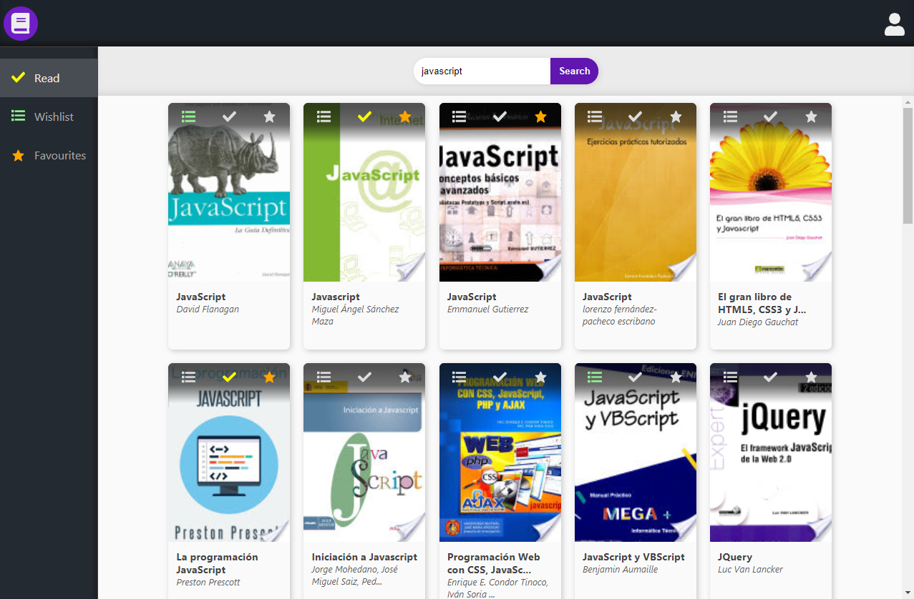
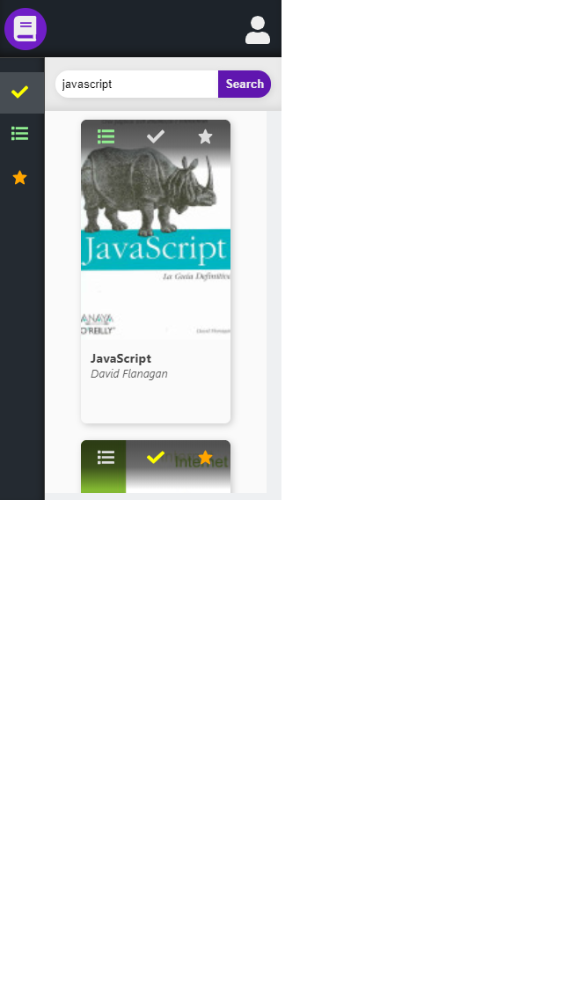

#  My books app
My own React app using Google Books API, made from scratch.

## :clipboard: Table of contents 
* [General info](#information_source--general-info)
* [Screenshots](#screenshots--camera)
* [Technologies](#technologies--computer)
* [Features](#features--bulb)
* [Status](#status--question)

##  :information_source: General info 
My books app allows to search for books and add them to the read books list, wishlist and favourites.

## :camera:  Screenshots  



## :computer:  Technologies  
* HTML5 
* SCSS 
* JavaScript ES6 
* NPM 6.9.0 
* React 16.8.6

## :gear: Setup 
To run this project, install it locally using npm:
```
$ npm install
$ npm start
```

## :bulb: Features  
:heavy_check_mark: Searching books in the Google Books API and displaying them
 :heavy_check_mark: Adding selected books to the read books list, wishlist or favourites

To-do list:
:heavy_minus_sign: Displaying read books, wishlist or favourites after clicking on the icon in the sidebar
:heavy_minus_sign: Registering and signing in

## :question: Status  
Project is in progress.
