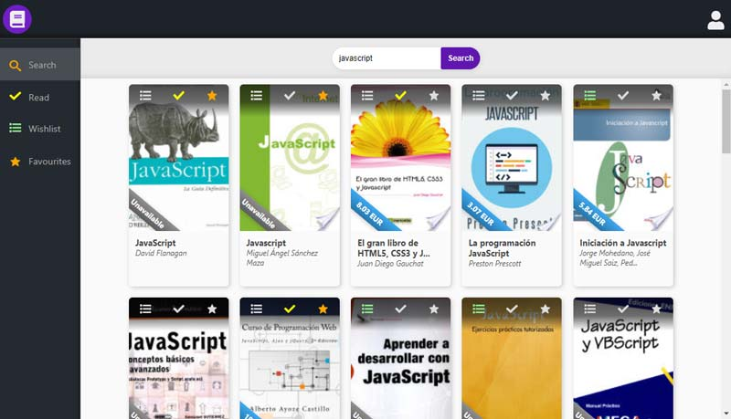
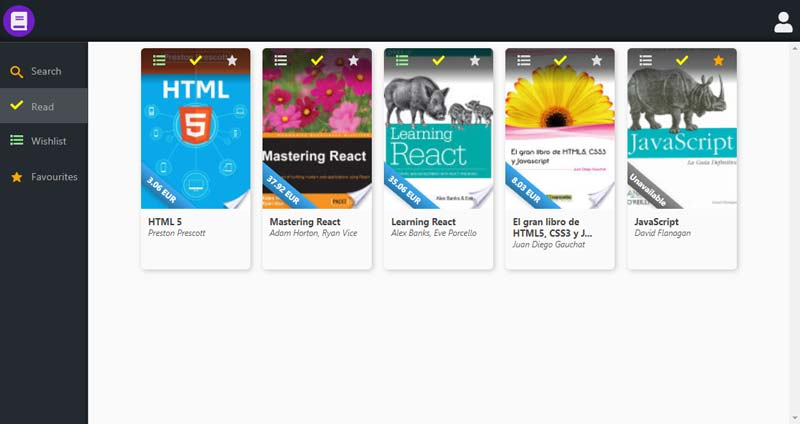
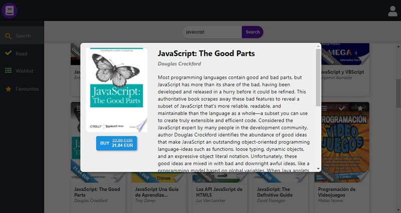

#  My books app with Redux
My own React app using Google Books API, made from scratch.

## :clipboard: Table of contents 
:small_orange_diamond: [**General info**](#information_source-general-info)

:small_orange_diamond: [**Screenshots**](#camera-screenshots)

:small_orange_diamond: [**Technologies**](#computer-technologies)

:small_orange_diamond: [**Features**](#bulb-features)

:small_orange_diamond: [**Status**](#question-status)

:small_orange_diamond: [**Acknowledgements**](#arrow_down-acknowledgements)

##  :information_source: General info 
My books app allows to search for books and add them to the read books list, wishlist and favourites.

## :camera: Screenshots  





## :computer: Technologies  
* HTML5 
* SCSS 
* JavaScript ES6 
* NPM 6.9.0 
* React 16.8.6

## :gear: Setup 
To run this project, install it locally using npm:
```
$ npm install
$ npm start
```

## :bulb: Features  

:heavy_check_mark: Searching books in the Google Books API and displaying them

:heavy_check_mark: Adding selected books to the read books list, wishlist or favourites

:heavy_check_mark: Displaying read books, wishlist or favourites after clicking on the icon in the sidebar

:heavy_check_mark: Displaying books information in the modal with an option to buy or read in Google Play

#### :soon: To-do list:

:heavy_minus_sign: Registering and signing in

## :question: Status  
Project is in progress. :construction:

## :arrow_down: Acknowledgements
* [Google Books API](https://developers.google.com/books/) 
* [Styled Icons 7.12.0](https://styled-icons.js.org/)
* [Styled Components 4.2.0](https://www.styled-components.com/)
* [Superagent 5.0.5](https://www.npmjs.com/package/superagent)
* [react-router-dom 5.0.0](https://reacttraining.com/react-router/web/guides/quick-start)
* [react-redux 7.0.3](https://react-redux.js.org/)
* [redux-logger 3.0.6](https://www.npmjs.com/package/redux-logger)
* [react-reveal 1.2.2](https://www.react-reveal.com/)
* [redux-thunk 2.3.0](https://www.npmjs.com/package/redux-thunk)